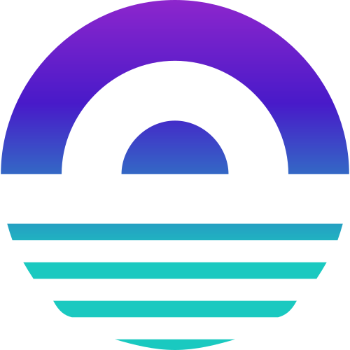
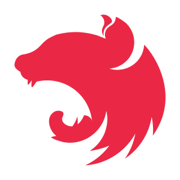
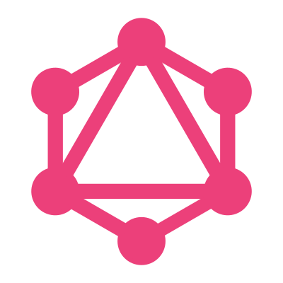

<h1>wryze</h1>

| submodule | link                                                                                                                                                                                                                                                                                                                                                                                                                         |
| --------- | ---------------------------------------------------------------------------------------------------------------------------------------------------------------------------------------------------------------------------------------------------------------------------------------------------------------------------------------------------------------------------------------------------------------------------- |
| client    | https://github.com/frog1123/wryze-client                                                                                                                                                                                                                                                                                                                                                                                     |
|           | 

                                                                                                                |
| server    | https://github.com/frog1123/wryze-server                                                                                                                                                                                                                                                                                                                                                                                     |
|           | 

 |

# client

- uses nextjs
- uses tailwindcss for styling
- uses apollo for fetching

# server

- uses nestjs
- uses apollo for graphql
